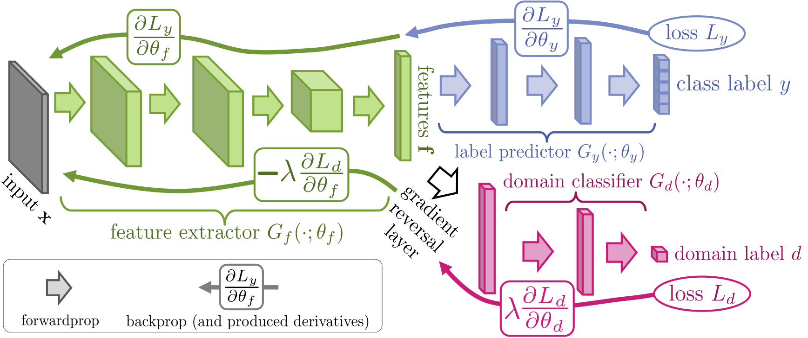

# Unsupervised Domain Adaptation

## Goal
Train a car model classifier for real world images, given a big quantity of rendered (synthetic) images that are labeled and a set of real world images that are not labeled.

## Background
In a simple problem setting, the domain of the input data at training and testing time is expected to be the same: both times the data shows the same distribution. Different distributions are also known as different domains. This is the case, for example, when training on one type of image, but performing inference on another type. In our case the soure domain is synthetic images. The target domain is real images. A classifier trained solely on the synthetic images performs poorly on real images. But the amount of labeled real images is limited, so training on real world images becomes challenging. Since we do have access to a large amount of labeled synthetic data, we will try to leverage the synthetic data to train a classifier for real world images. 

## Domain-Adversarial Neural Networks (DANN)
A domain-adversarial neural network consists of a feature extractor, a label classifier and a domain classifier. The features extracted by the feature extractor are used by the label classifier to infer the label (in our case the car model) and by the domain classifier to infer which domain an image is coming from. The weights for these three parts are trained jointly, with the aim of learning to extract features that enable the label classifier to infer the correct label while making it difficult for the domain classifier to infer the domain from those same features. The ideal result is a feature extractor that extracts features that are domain-invariant and from which the label classifier can infer the correct label.

## Getting started (locally)

0. Clone `git clone git@github.wdf.sap.corp:D073679/unsupervised-domain-adaptation.git`
0. Change into repo `cd unsupervised-domain-adaptation`
0. Install dependencies `pip install -r requirements.txt`
0. Create a directory `mkdir data` at the root of the repo
0. Download `synthetic_new_for_model_classification_fixed_cropped` and `real_new_for_model_classification_cropped_cleaned` from S3 to the `data` directory
0. Train `python train.py --source-domain-dir data/synthetic_new_for_model_classification_fixed_cropped --target-domain-dir data/real_new_for_model_classification_cropped_cleaned`

## Getting started (SageMaker)
See `demo.ipynb`

## Implementation details
There are two available classifiers: a "normal" classifier that can be trained on data of one domain (`--mode source`) as well as a classifier that implements DANN and can be trained on data from the source and target domain (`--mode dann`). They are trained differently and I am currently using two different training functions.

## References
* [Unsupervised Domain Adaptation by Backpropagation](https://arxiv.org/abs/1409.7495)
* [Domain-Adversarial Training of Neural Networks](https://arxiv.org/abs/1505.07818)